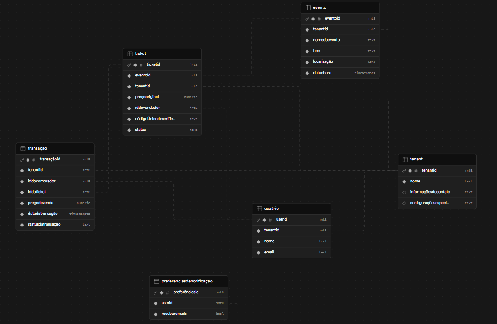

# csw24-grupoG-ticket-gin

Trabalho da disciplina de construção de software da PUCRS 2024/2

## Alunos

- Caio Batista
- Eduardo Garcia
- Eduardo Riboli
- João Schwingel
- Jocemar Nicolodi

## Como rodar

```bash
# rodar uma vez só para buildar os containers
docker-compose up --build
```

```bash
# com os containers já criados
docker-compose up
```

```bash
# para listar os containers ativos
docker-compose ps


# para listar os containers desligados
docker-compose ps -a
```

```bash
# parar os containers mas sem removêlos
docker-compose stop
```

## Infraestrutura

1 - Adicionar as credenciais da aws no arquivo ~/.aws/credentials

OBS: toda vez que ligamos o lab, as credenciais mudam, chatão

2 - Rodar o comando para iniciar o terraform:

```bash
terraform init
```

3 - Explicar o plano de criação do terraform com:

```bash
terraform plan
```

4 - Subir a infraestrutura na aws

```bash
terraform apply
```

5 - Uma vez dado terraform apply, o terraform irá gerar uma chave ssh, essa chave é unica de pessoa para pessoa, se o fulano rodar terraform apply e o ciclano também, ambos terão duas chaves ssh diferentes. A chave ssh pode ser acessada rodando os seguintes comandos

```bash
terraform output -raw private_key_pem > my-key.pem
```

após isso, um arquivo `.pem` será criado no diretório de `/infra`, esse arquivo é sua chave ssh que você poderá usar para se conectar na sua instância de EC2 criada na AWS. Para fazer isso, rode os seguintes comandos:

```bash
# Adiciona regras de segurança para chave ssh
chmod 400 my-key.pem
```

```bash
# Substitua  <EC2_PUBLIC_IP> pelo ip público da sua EC2 recém criada
ssh -i my-key.pem <EC2_PUBLIC_IP>
```

OBS: Muito cuidado para não perder o arquivo .pem!

## Data model



## To do's

- [ X ] Criar estrutura do projeto
- [ X ] Criar estrutura das pastas/arquitetura
- [ X ] Instalar uma ORM com um banco de dados
- [ X ] Instalar o Swagger
- [ X ] Criar todas as entities do datamodel com a ORM de Go
- [ X ] [Criar endpoint do useCase 1: Compra de ingresso](https://github.com/tecmx/csw242-system-docs/blob/main/UseCases.md#1-compra-de-ingresso) 
- [ X ] [Criar endpoint do useCase 2: Venda de ingresso](https://github.com/tecmx/csw242-system-docs/blob/main/UseCases.md#2-venda-de-ingresso)
- [ X ] [Criar endpoint do useCase 3: Gerenciamento de Eventos (Administrador)](https://github.com/tecmx/csw242-system-docs/blob/main/UseCases.md#3-gerenciamento-de-eventos-administrador)
- [ X ] [Criar endpoint do useCase 4: Autenticação de Ingresso no Evento](https://github.com/tecmx/csw242-system-docs/blob/main/UseCases.md#4-autentica%C3%A7%C3%A3o-de-ingresso-no-evento)
- [ X ] [Criar endpoint do useCase 5: Gestão de Preferências de Notificação](https://github.com/tecmx/csw242-system-docs/blob/main/UseCases.md#5-gest%C3%A3o-de-prefer%C3%AAncias-de-notifica%C3%A7%C3%A3o)
- [ X ] [Criar endpoint do useCase 6: Reembolso de Ingresso](https://github.com/tecmx/csw242-system-docs/blob/main/UseCases.md#6-reembolso-de-ingresso)
- [ X ] [Criar endpoint do useCase 7: Envio de Avaliação do Vendedor](https://github.com/tecmx/csw242-system-docs/blob/main/UseCases.md#7-envio-de-avalia%C3%A7%C3%A3o-do-vendedor)
- [ X ] [Criar endpoint do useCase 8: Visualização de Avaliações do Vendedor](https://github.com/tecmx/csw242-system-docs/blob/main/UseCases.md#8-visualiza%C3%A7%C3%A3o-de-avalia%C3%A7%C3%B5es-do-vendedor)
- [ X ] Instalar o Docker e fazer rodar tudo no local
- [ X ] Rodando local, mudamos para um banco de dados na nuvem, para melhor escalabilidade (Tinhamos combinado que seria o RDS da AWS)
- [ X ] Conectamos nossa aplicação com Docker à esse banco na nuvem e nos certificamos que esteja tudo rodando 
- [ X ] Criar a infraestrutura da AWS com o Terraform
- [ X ] Subir a aplicação na AWS
- [  ] Ser feliz
- [  ] Ser ainda mais feliz